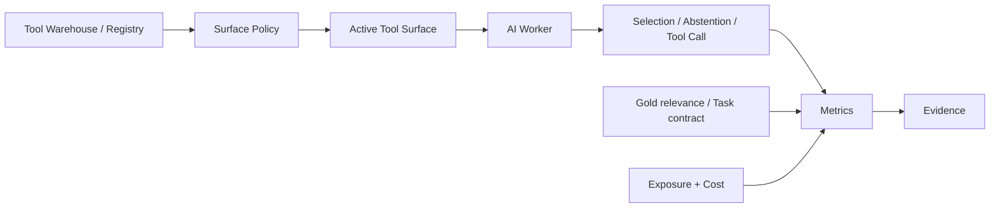

# finite-tool-surface-lab

A small, reproducible research lab for studying how much tool surface an AI Worker should see.

> **Core question:**  
> Can an AI Worker preserve or improve task performance by seeing a smaller, evidence-selected active tool surface instead of the full available Tool Warehouse?

## Status

**Open research — repository bootstrap / Phase 0**

The repository inherits its research discipline from `hopeless-t/topological-spin-lab`.

```text
Question
  ↓
Experiment / Benchmark Spec
  ↓
Surface Policy / Registry Model
  ↓
Calculation
  ↓
Observable
  ↓
Acceptance
  ↓
Evidence
```

A successful program execution is not automatically a successful research result.

`Plan != Result`  
`Figure != Evidence`  
`Research Finding != MVCA Mainline Decision`

## Why this project exists

Agent systems are accumulating more tools, skills, plugins, MCP services, and specialized providers.

But:

```text
More available capability
!=
More capability that should be visible at once
```

Large tool surfaces consume context, add latency, create distractors, and may increase wrong-tool selection. Too-small surfaces can hide required capability.

This project studies the boundary between those failures.

The goal is not to build a production MCP router first.

The goal is to build a public computational laboratory where tool-surface claims are reproducible, falsifiable, and transferable.

## Research boundary

This repository does **not** currently claim to:

- prove that fewer tools are always better;
- define one universal optimal `k`;
- qualify any Tool for MVCA;
- grant execution authority;
- replace Tool/Skill qualification;
- prove production performance from synthetic tasks;
- promote an Active Tool Surface policy into MVCA Mainline.

The first stages separate retrieval/surface behavior from Worker behavior.

```text
Registry Coverage
!= Retrieval Quality
!= Worker Selection Quality
!= End-to-End Task Success
```

## North-star

The North-star is the **Tool Surface Frontier (TSF)**:

> the Pareto frontier between end-to-end task success and the cost/risk of the tool surface exposed to a Worker.

A derived summary is **MSTS(epsilon) — Minimum Sufficient Tool Surface**:

> the smallest surface that remains within a declared tolerance of an oracle-relevant surface while satisfying coverage and false-invocation constraints.

We do not optimize minimum tool count alone.

```text
Fewer Tools != Better System
Tool Available != Tool Visible
Tool Visible != Tool Selected
Tool Selected != Tool Qualified
Tool Qualified != Tool Authorized
```

See [docs/NORTH_STAR.md](docs/NORTH_STAR.md).

## At a glance



The diagram is a navigation aid, not an empirical result.

## Research states

Every implemented benchmark or validation ends in one of four states:

```text
PASS
  Execution completed and all contract integrity / acceptance checks passed.

FAIL
  Execution completed but one or more declared checks failed.

INVALID
  The spec was invalid and research execution did not begin.

ERROR
  Software, runtime, or I/O failure prevented valid evaluation.
```

PASS means the benchmark contract ran correctly. It does **not** mean a preferred hypothesis won.

## Research lanes

```text
RQ-xxx     open research question
VAL-xxx    harness / method / dataset validation
BENCH-xxx  comparative computational benchmark
REF-xxx    named reference object when needed
```

### VAL-001 — Synthetic Registry / Harness Validation

Before asking whether small surfaces help, validate deterministic registries, exact gold sets, no-tool cases, chance controls, invalid-spec rejection, and broken-control detection.

See [docs/VAL-001.md](docs/VAL-001.md) and [specs/VAL-001.json](specs/VAL-001.json).

### BENCH-001 — Fixed-k Surface Sweep

Compare `ORACLE`, `FULL`, `RANDOM-k`, and a simple deterministic lexical retrieval surface across controlled registry size and overlap.

This is initially a **retrieval/surface benchmark**. It may not claim end-to-end Worker degradation.

See [docs/BENCH-001.md](docs/BENCH-001.md) and [specs/BENCH-001.json](specs/BENCH-001.json).

## Planned sequence

```mermaid
flowchart LR
    V1["VAL-001<br/>Synthetic registry + harness"] -->
    B1["BENCH-001<br/>Fixed-k surface sweep"] -->
    B2["BENCH-002<br/>Adaptive-k"] -->
    B3["BENCH-003<br/>Distractor stress"] -->
    B4["BENCH-004<br/>Representation ablation"] -->
    B5["BENCH-005<br/>No-tool abstention"] -->
    B6["BENCH-006<br/>Multi-tool surfaces"] -->
    V2["VAL-002<br/>Public benchmark adapters"] -->
    B7["BENCH-007<br/>Worker-in-the-loop"] -->
    M["MVCA transfer candidate"]
```



Roadmap nodes describe intent, not implemented results.

## What we measure

The lab will not report only Top-1 accuracy.

Core observables include:

- gold-tool coverage;
- visible tool count;
- serialized bytes / tokens;
- retrieval latency;
- selection accuracy conditional on gold presence;
- wrong-tool invocation;
- false invocation on no-tool tasks;
- end-to-end task success;
- tool-call count;
- reasoning turns;
- provider/runtime cost where observable.

Analysis may include:

- paired comparisons;
- bootstrap confidence intervals;
- surface-size response curves;
- change-point candidate detection;
- factorial sensitivity analysis;
- Monte Carlo workload mixtures;
- Pareto-frontier construction;
- power analysis before expensive Worker runs.

## Repository structure

The shape intentionally mirrors `topological-spin-lab`.

```text
finite-tool-surface-lab/
│
├── specs/
│   ├── VAL-001.json
│   └── BENCH-001.json
│
├── src/
│   └── finite_tool_surface_lab/
│       ├── spec.py
│       └── results.py
│
├── tests/
│
├── evidence/
│
├── research/
│
├── docs/
│
└── .github/
    └── workflows/
```

No empty-directory architecture theatre: components are added only when a real research contract needs them.

## Reproducibility model

```text
Question
  ↓
Frozen Spec
  ↓
Execution
  ↓
Structured Observation
  ↓
Acceptance
  ↓
Evidence
```

Canonical evidence should identify exact source commit, spec/hash, fixture or dataset digest, seeds, runtime/platform, raw structured observations, aggregate metrics, limitations, and claim ceiling.

Large datasets should be referenced by pinned release/hash and reproducible download/transformation scripts rather than copied blindly into Git.

## Public-repository advantage

Public work is part of the method.

Outside researchers should be able to:

- rerun the same spec;
- submit another surface policy;
- contribute adversarial distractor registries;
- reproduce on another model/provider;
- report a failed replication;
- falsify a headline claim;
- compare against the same task-level evidence.

Negative results are first-class results.

A canonical public claim cannot rely solely on private Catfood/MVCA data or a private provider.

## Development philosophy

Inherited from `topological-spin-lab`:

```text
functional core
+
thin imperative shell
```

The deterministic research core should not depend on network, Git, wall clock, UI, or private services.

Provider/model calls, when later introduced, live outside that core and must be recorded as experimental conditions.

The harness is incomplete if it can demonstrate PASS but cannot detect broken policies, invalid specs, or corrupted ground truth.

## Prior art

The initial map includes Toollery, shortlist-depth/BoR research, SkillRouter, BFCL, ToolBench / StableToolBench, RAG-MCP, and scalable MCP gateway work.

See [docs/REFERENCES.md](docs/REFERENCES.md) and [docs/LITERATURE_MAP.md](docs/LITERATURE_MAP.md).

## Relationship to MVCA

Possible future transfer target:

```text
Qualified Tool Warehouse
        ↓
Active Tool Surface Governor
        ↓
bounded evidence-selected projection
        ↓
Worker
```

But:

```text
Capability Warehouse Size != Active Tool Surface Size
Tool Surface Optimization != Authority Optimization
Retrieval Confidence != Execution Authority
```

A smaller visible surface must never silently widen authority, hide mandatory gates, or turn retrieval confidence into permission.

## Finite RAM working-set transfer

The Finite RAM Lab B461-B500 line provides a directly relevant experimental method for treating the active tool surface as a finite semantic working set without confusing visibility with authority.

See [docs/FINITE-RAM-WORKING-SET-TRANSFER-2026-10-02.md](docs/FINITE-RAM-WORKING-SET-TRANSFER-2026-10-02.md).

The transfer is methodological: hosted RAM thresholds and q values are not imported.

## License

MIT. See [LICENSE](LICENSE).

## Project principle

> **Expose enough capability to solve the task, but require evidence before claiming how much is enough.**
